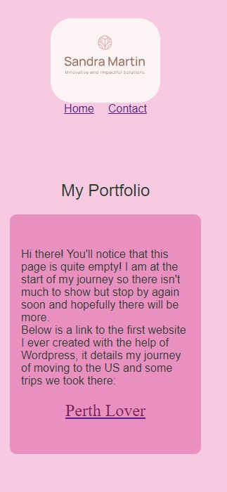

#  Sandra - Portfolio Task
​
(https://sandramcodes.github.io/)
​
## Project Requirements

### Content
 Add a short paragraph describing the features below. What aesthetic and technical choices did you make? 

- [x] At least one profile picture

I included a picture of me at my favourite beach in Southern California

- [x] Biography (at least 100 words)

Hi there! I'm Sandra, an aspiring coder with a background in IT and executive support. Over the past two decades I've gained global experience and diverse perspectives through my work in locations including Perth, London, Canada, California, Sydney and Melbourne, primarily in the IT and mining sectors. Driven by a lifelong curiosity and a love for technology my goal is to harness my technical skills to create innovative and impactful solutions to businesses.   
        
If you've got a problem, let's solve it together. 

In my personal life my passions are furniture restoration and interior design, along with food and wine

See here for a link to my portfolio:

- [x] Functional Contact Form
- [x] "Projects" section
- [x] Links to external sites, e.g. GitHub and LinkedIn.
https://www.linkedin.com/in/sandradimartin/ 
https://github.com/SandraMCodes

​
### Technical
 Add a short paragraph describing the features below. What strategies or design decisions did you work from? 

 I have 3 pages in my site - home, projects and content.  I worked on a basic layout in excalidraw to look at how I would do my design.

- [x] At least 2 web pages.
- [x] Version controlled with Git
- [x] Deployed on GitHub pages.
- [x] Implements responsive design principles.
- [x] Uses semantic HTML.

### Bonus (optional)
 Add a short paragraph describing the features below, if you included any. 
- [ ] Different styles for active, hover and focus states.
- [ ] Include JavaScript to add some dynamic elements to your site. (Extra tricky!)
​
### Screenshots
> Please include the following:

> - The different pages and features of your website on mobile, tablet and desktop screen sizes (multiple screenshots per page and screen size).
> - The different features of your site, e.g. if you have hover states, take a screenshot that shows that.  
> You can do this by saving the images in a folder in your repo, and including them in your readme document with the following Markdown code: 

####  image_title_goes_here 

